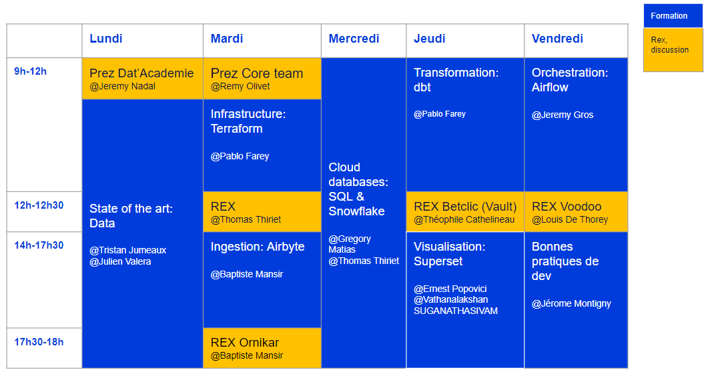

# Dat'Academie

## Content
This repository contains the training material of the Dat'Academie.

You can also find additional content on the
[drive](https://drive.google.com/drive/u/1/folders/1RPioLQTzW15mac1uJZ-JW5dUrivYisSU), and there is a very quick presentation [here](https://docs.google.com/presentation/d/1wl3hc0iti8rkUlcfWHSv1dSXxTokZYyn1Qabb16gAo4/edit?usp=sharing)

## What is it ?
A training that allows you to quickly get to know the data engineer's ecosystem. From data ingestion to data enhancement in a dashboard, through production and development best practices.

## How ?
* Build a whole data platform from scratch using open data [Velib Metropole](https://www.velib-metropole.fr/donnees-open-data-gbfs-du-service-velib-metropole)
* Being trained by experimented data engineers
* Having talks on more complexe projects to be able to understand how far we can go using those tools

The plan of the training is : 

## Why ? 
* Accelerate skills development
* Be ready day 1 in mission
* Identify which tool for which step of a project and get some practice on them
* Get to know collaborators from other agencies
* Identify referents by technology in order to facilitate exchanges and requests for support

## Who's that for ?
Anyone new in the data world: interns, newcommers, reconversion, ...

## Caveats
The idea is not to become an expert in each of the tools used, but to understand at what point in a project these tools come into play and to what extent. To go deeper into each tool, there are whole training for that. 

Also, we cannot see every tool a data engineer could use and therefore, we focused on the so called "Modern Data Stack".

## Ideas for future
* Great expectations ? During dbt or best practices ?